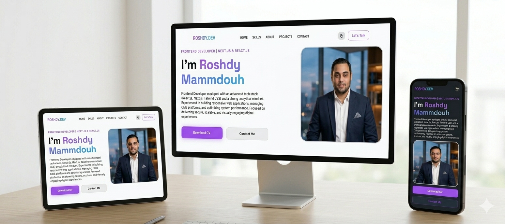

# 🚀 ROSHDY.DEV | Modern Developer Portfolio

Welcome to my official portfolio project! This is a high-performance, visually engaging developer portfolio built with **Next.js 15**, **React**, and **Tailwind CSS**.



## ✉️ Contact Me
Feel free to reach out via:

[](mailto:roshdy.mammdouh@gmail.com)
[](https://github.com/Roshdy0)
[](https://www.linkedin.com/in/roshdy-mammdouh-2b29653b1/)
[](https://wa.me/201117651690)


## ✨ Features

- **Modern UI/UX**: Crafted with a focus on aesthetics and smooth user experience.
- **Fully Responsive**: Optimized for all devices from mobile to desktop.
- **Dynamic Contact Form**: Integrated with **Formspree** for seamless communication.
- **Optimized Performance**: Leveraging Next.js Server Components and advanced CSS techniques.
- **Personal Branding**: Showcasing projects like the Cowboy Game and professional services.

## 🛠️ Tech Stack

- **Framework**: Next.js 15 (App Router)
- **Styling**: Tailwind CSS & Modern CSS (Nesting, Logical Properties)
- **Icons**: Font Awesome & Lucide-React
- **Form Handling**: Formspree


## 📂 Project Structure
- **app**: Next.js App Router components and pages.

- **public**: Static assets (images, icons).

- **styles**: Global and component-specific CSS (including contact.css and header.css).

## 🚀 Getting Started

First, run the development server:

```bash
npm run dev
# or
yarn dev
```